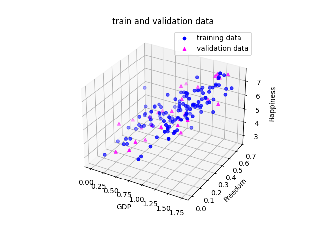
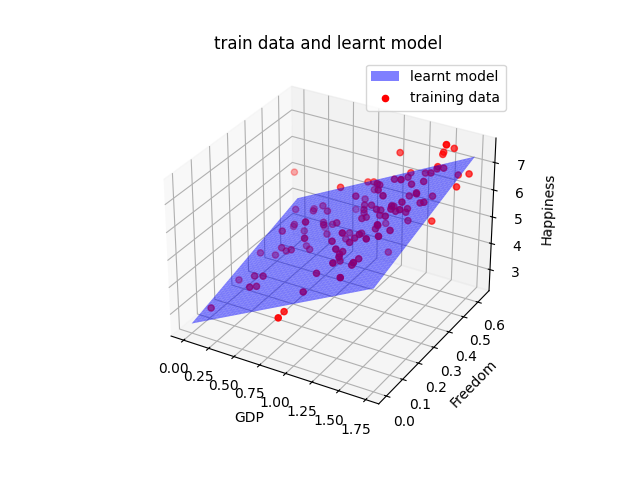
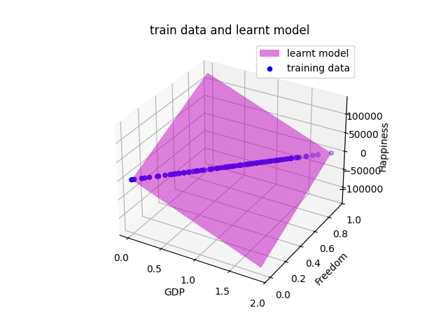

## What is it ?
Supervised learning -> machine learning where you train a model using labeled data =>  *we already know the the correct answers*

## How ?
We show the model many examples: input -> correct output
It leans the pattern (so based on var1...varn => output)
They can predict the outputs for **new** inputs

## Our problem
 **Inputs (features):** GDP + Freedom → these are your 2 independent variables- **Output (label):** Happiness Score → this is what you want to predict
The "correct answers" (happiness scores) are **already in the dataset** — that's what makes it *supervised*

## Train vs Validation *data*

**Core**: we cannot test the model using the same data it learned from, we use `80%` of data as training data and `20%` as validation/*testing* data

```python
np.random.seed(5)
(...)
trainSample = np.random.choice(indexes, int(0.8 * len(inputs)), replace=False)
validationSample = [i for i in indexes if not i in trainSample]
```

We *randomly* pick 80% of the idx's without repetition (`replace=False`), we use a set seed, *same training data each time*
The *rest* becomes the validation data



## The *Learning Step*

**What are we doing**: we want to fin a plane (line) that goes as close to the points as possible 

Using 1 data point => drawing a line `happiness = w0 + w1 * GDP`
Using 2 data points => drawing a plane `happiness = w0 + w1 * GDP + w2 * Freedom`



### Least Squares

Each value `w0 w1 w2` have an error rate, we are trying to minimize it as much as possible, we cannot sum them for total error so we square the, `total error = (error1)² + (error2)² + (error3)² + ...`

## Correlated Data

So in some cases 2 metrics we use can be correlated (meaning wx = wy * n, where n is a number), so *example* the **v2 data set**  `GDP:     1.6164  →  Freedom: 0.8082  (= GDP / 2)`

### The Effect

This cause **multicoliniarity** => the model cannot determine individual weights and they become large `f(x1, x2) = 3.20 + (-68616.18) * x1 + (137236.67) * x2`



# Our own Regression Model

### What is it ?
Basically  just a function `f: R^n -> R` where n is the number of coeficients it takes
`f(x) = w0 + w1*x1 + w2*x2 + ... + w(n-1)*xn` where w[0->n-1] are the weights

The ***.fit()*** function :
for each training sample we use prediction, but we also get the result => we can adjust the weights to better fit what we want

```
predicted:  f(x) = w0 + w1*x1 + w2*x2
real:       y
error:      y - f(x)
```


The ***.predict()*** function:
now using the calibrated weights we can use new data to try and predict our output based on our input

*We basically use the weights we store*
```python
def predict(x1, x2):
    return w0 + w1*x1 + w2*x2
```


#### The Formula:
`w1 = (n*Σxy - Σx*Σy) / (n*Σx² - (Σx)²)   w0 = (Σy - w1*Σx) / n`

```python
class MyLinearUnivariateRegression:

	def __init__(self):
	self.w0 = 0.0
	self.w1 = 0.0
	
	def fit(self, inputs, outputs):
		sum_inputs = sum(inputs)
		sum_outputs = sum(outputs)
		
		sum_inputs_2 = sum(input**2 for input in inputs)
		sum_input_output = sum(input*output for input,output in zip(inputs,outputs))
		
		n = len(inputs)
		w1 = (n*sum_input_output - sum_inputs*sum_outputs)/(n*sum_inputs_2 - sum_inputs*sum_inputs)
		w0 = (sum_outputs - w1*sum_inputs)/n
		
		self.w0, self.w1 = w0, w1
	
	def predict(self, input):
		if (isinstance(input[0], list)):
			return [self.w0 + self.w1 * val[0] for val in input]
		else:
			return [self.w0 + self.w1 * val for val in input]
```

## Bivariate Regression under the hood

We will be building a matrix X, where each row is one country (for our example), each column is a feature (GDP and Freedom), first column will be 1 for the w0 ( `w0*1 + w1*GDP + w2*Freedom`)

Outputs become a vector `y = [happiness_norway, happiness_denmark,happiness_iceland, ...]` 

The W vector is a vector that contains [w0, w1, w2 ... wn], and its formula is `W = (X^T * X)^(-1) * X^T * Y`

Using **Gaussian Elimination** to solve for W vector

```python
def fit(self, inputs, outputs):

	X = [[1, sample[0], sample[1]] for sample in inputs]
	y = [[val] for val in outputs]
	Xt = self.get_transpose_matrix(X)
	XtX = self.get_produce_matrix(Xt, X)
	XtX_inv = self.get_inverse_matrix(XtX)
	Xty = self.get_produce_matrix(Xt, y)
	W = self.get_produce_matrix(XtX_inv, Xty)
	
	self.w0 = W[0][0]
	self.w1 = W[1][0]
	self.w2 = W[2][0]

def predict(self, inputs):
	return [self.w0 + self.w1 * sample[0] + self.w2 * sample[1] for sample in inputs]
```
