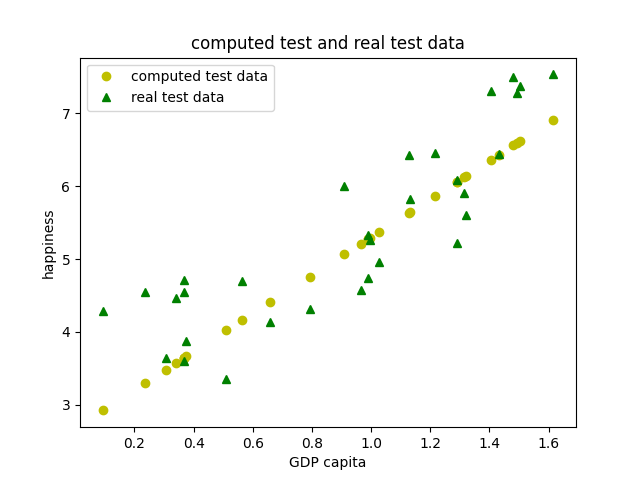
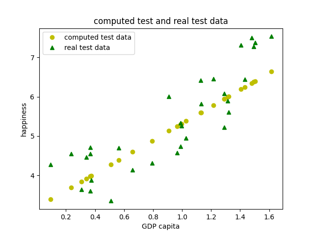
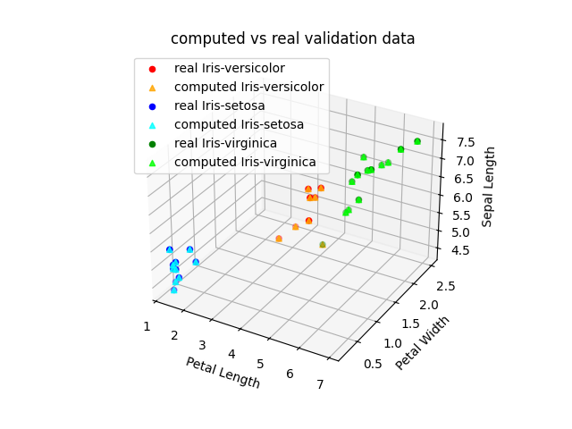

So we will be basically building a more complex *'regression model'* per say, we will train a model using **Gradient Descent** to solve the same task we had the last lab [[AI Lab 5 Supervised Learning]]

# Batch Gradient Descent
## How does it work ?

We take all n training samples at once and we compute * predictions and errors * for every sample,  the weights are only updated once 

**Basically**: Before we do anything we take a look at all the training data, it is slower but each step is accurate

```python
regressor = SGDRegressor(
	loss='squared_error', # MSE loss
	learning_rate='constant',
	eta0=0.01, # leanrig rate
	max_iter=1000,
	tol=None,
	shuffle=False,
	random_state=42
)
```

### Differences to Stochastic
* The learning rate isnt  set to `optimal`, decreases over time to settle the noise
* The eta matters much more in SGD since it can cause oscillations
* BGD does only 1000 epochs *(weight updates)*, SGD does `1000*n`
* tol *(early stop: when improvements become insignificant)*, SGD.tol = 1
* `shuffle=False` -> data set is used as one , SGD has a random order
## Learning Rate Sensitivity

BGD is highly sensitive to the learning rate. Without feature scaling, the valid range is very narrow -> in this case `learning_rate=0.0031` was optimal. Values slightly above caused divergence, values below caused slow convergence.
### Differences

| Learning Rate   | MSE   | Image                         |
| --------------- | ----- | ----------------------------- |
| 0.001 (default) | 20.39 |   |
| 0.0031          | 0.45  |    |
| Model           | 0.42  |  |
| 0.004           | 0.49  |                               |
| 0.003           | 0.46  |                               |

# Logistic Regression

## What if we want to determine a boolean value

**Example**: Tell by the *Radius* and *Texture* of the tumor if its Malignant (M) or Benign (B) 

We use the **Sigmoid Function**: `σ(z) = 1 / (1 + e^(-z))` to map any input to a probability between 0 and 1

**The model**: `z = w0 + w1*radius + w2*texture`  and  `P(malignant) = σ(z)`
And we classify anything above(or equal) 1/2 as M and under 1/2 as B

The 2nd graph represents the **Decision Boundry**: basically the line that separates M from B


Instead of minimizing MSE (like *LinearRegression*) [[AI Lab 5 Supervised Learning]] we are minimizing 
`Loss = -1/n * Σ [yi * log(f(xi)) + (1-yi) * log(1-f(xi))]



