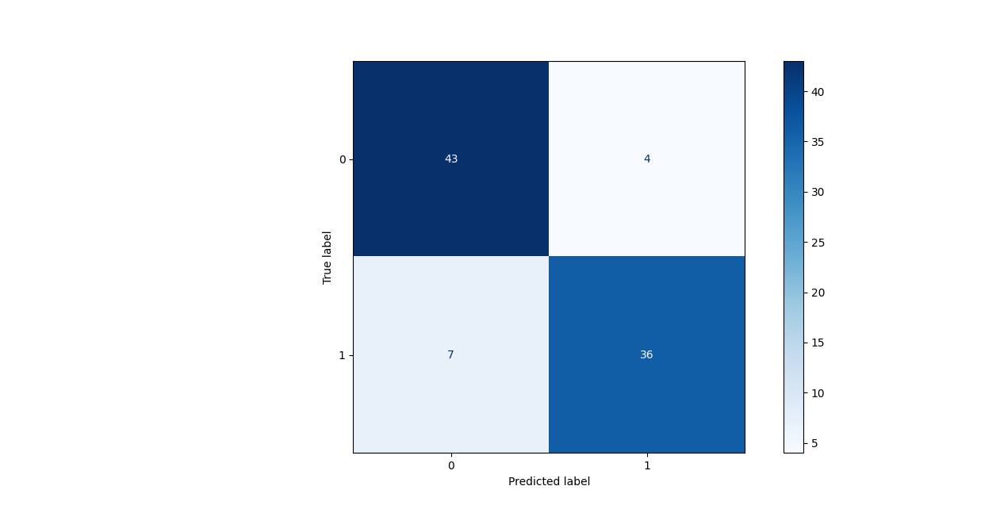
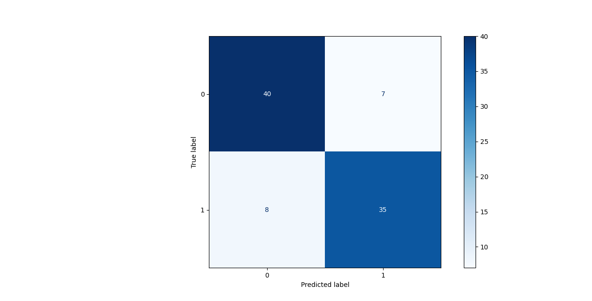
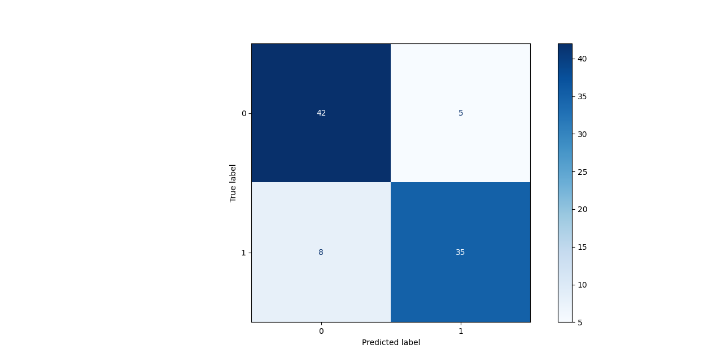

*Train a ANN and CNN to detect if a sepia filter was used on a photo* -> Binary Classificator again

```
< 0.5 -> no sepia
> 0.5 -> sepia
```

## About the Data Set

We will be using the `https://www.kaggle.com/datasets/sujaykapadnis/smoking`  to create our data set by applying a filter to the Testing images of non smokers/smokers

```python
def apply_sepia(input_image_path, output_image_path):
    image = Image.open(input_image_path).convert("RGB")
    pixels = image.load()
    for i in range(image.width):
        for j in range(image.height):
            r, g, b = pixels[i, j]  # fix: use pixels not getpixel
            tr = min(int(0.393 * r + 0.769 * g + 0.189 * b), 255)
            tg = min(int(0.349 * r + 0.686 * g + 0.168 * b), 255)
            tb = min(int(0.272 * r + 0.534 * g + 0.131 * b), 255)
            pixels[i, j] = (tr, tg, tb)
    image.save(output_image_path)
```

We are shifting the tone to the browns and maxing out the RGB values

**Mention**: all images in the data set are by default *250x250*, because they need more features, we will scale down to a *32x32* since we dont need that many

## Sklearns TOOL
For the tool we are using `MLPClassifier`, and with these values , we get 88% accuracy

```python
MLPClassifier(
	hidden_layer_sizes=(128, 64),
	activation='relu',
	solver='adam',
	max_iter=100,
	random_state=42,
	learning_rate_init=0.0001,
	verbose=True
)
```



### Hyper-parameter influence

**What is it ?**

How we manually set the model to behave, how it learns. Example:
- `hidden_layer_sizes` : architecture of network `(256, 128, 64)` is deeper but slower -> gives out accuracy of `85%` which is worse for our data set, `(64)` -> one layer -> `82%`
- `activation` : how neurons fire -> `relu` and `logistic` give the same accuracy
- `solver`: how the weights are updated, `adam 87%` and `sgd 72%` *with the rest as above*
- `max_iter`: epochs to train, 100 -> `87%`, 150 -> `85%`
- `learning_rate_init`: step size updates `0.001 -> 87%`, `0.0001 -> 81%`

# Our own Artificial Neural Network

## The helpers

- **Rectified Linear Unit**: *ReLU* returns the maximum of 0 or X, it kills negative values and keeps the postive ones (*Example: relu(3) = 3, relu(-2) = 0, relu(0) = 0*) 
- **ReLU Derivative**: returns either 0 or 1 (*as a float*) -> represents 1 - for contributing neuron and 0 - for dead neuron (*Example: relu_deriv(3) = 1.0, relu_deriv(-2) = 0.0*), mainly used in the backprop part to find out a neurons contribution
- **Sigmoid**: squishes value between 0 or 1, where 0 or 1 represents the 2 classes -> probablity of it being sepia in our case
- **Sigmoid Derivative**: tells us how sensitive a neurons output is based on the input changing 
### Why are we using both

**Hidden layers** -> ReLU
**Output layers** -> Sigmoid

## Initialization

So we are running a 2 layer ANN, (layer 0 -> `32x32x3` (number of pixels on an impage),*layer 1 -> 128 , layer 2 -> 64*)
- `W1, W2, W3`: weight matrixes , learn parameters, we set the initial weights with **He initialization** -> scale weight on layer size 
- `b1, b2, b3`: biases, small adjustments so each layer fits the data, start at 0 and they train
## Fitting 

We are using **Mini-Batch Gradient Descent** -> shuffle data, split into samples, for each we make predictions (#forward), calculate err (#backward) and we update the weights

### How the shuffle gives different accuracy

```python
indices = np.random.permutation(data.shape[0])
data_shuffled = data[indices]
y_shuffled = y[indices]
```

We shuffle the data so ANN sees samples in different orders -> learns better, preventing order memo

Thats why we can see a difference between `2-5%` of accuracy change

### Updating the weights

We update the weights each `batch_size` samples, instead of doing it all at once

### Forward and Backward then Updating

**Forward**: data flows thru the network sequencially layer-by-layer, each time we multiply input by weight add bias (`data * weight + bias`), with ReLU we remove negatives, we do this for each layer and at the end with Sigmoid we classify it

**Backward**: we calculate how much each weight contributed to the loss using the ReLU Deriv, starting from output and working towards the input. We calculate the (*for each layer*) the error signal, how much the weight should change and how much the bias should change

**Updating**: update the weights and bias for each layer, `weight = weight - learning_rate * change` and `bias = bias - learning_rate * change`, where each change is respective to their layer and weight/bias

## Predictions

We are basically doing the **Forward** part of Fitting, but with our trained weights, and the training dosent happend, then we convert it to binary output

## Results

| Run | Accuracy | Confusion Matrix |
| --- | -------- | ---------------- |
| 1 | 83.3% |  |
| 2 | 85.5%| |
