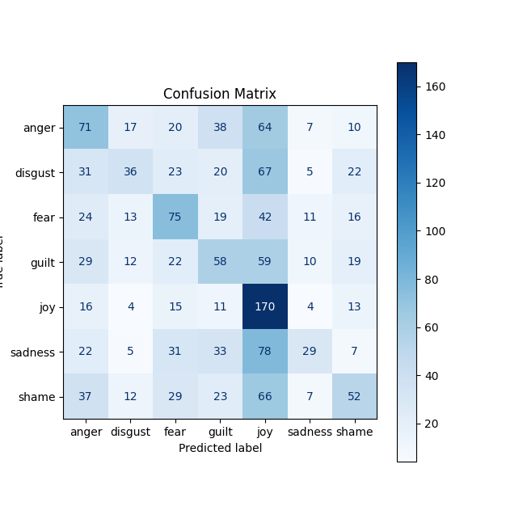
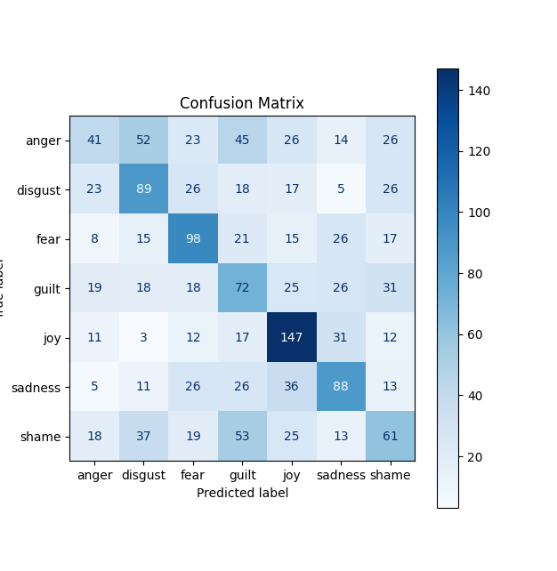

## Extractors

**Extractors** take raw text data and transform them into numbers a model can understand
*Example*: For each extractor we will use the sentence `The room was dirty and small`
and the dataset 
```
"The room was dirty and small"
"I am clean"
"The room was small"
```
### Bag Of Words

Uses an already defined vocabulary *example* `[small, dirty, I, am, room, and, was the, clean]` and then it converts the sentence into a counter array like, *for our example*
`[1,1,0,0,1,1,1,0]` -> the words `[I, clean]` dont appear, and the number represents the number of appearances

### Term Frequency-Inverse Document Frequency

Same as BoW, but the words are weighted, rarer words (*in the dataset*) get a higher score, common words lower (*like 'the'*), *for our example*  
`[0.21, 0.54, 0, 0, 0.31, 0.54, 0.21, 0.08, 0]`-> words that dont appear get a 0,the gets a 0.8, `and` is a common word, but in our data set is quite rare `1/3` 

### Word to Vector

Each word gets 4 values, and words that are similar in meaning get very close values, so we transform common words into 4 element arrays, *example*
`"dirty" → [−0.4, 0.6, −0.3, 0.2, ...]` and the word `"filthy" → [−0.3, 0.5, −0.4, 0.3, ...]`, close values, and then for a sentence we can average out each value, and then the closest word to that is the meaning, we need a bigger training dataset to show an example

### Custom Extractor (Sentimental)

Because we use the Isear dataset with emotions, I decided to have an extractor that reflects that. We use NRCLex's built in dictionary of 27k words mapped to 10 emotions -> automatically have the emotional weight behind the words.

*Example*: `Every time I imagine that someone I love could get seriously ill`
Each emotion reflected in a word gets a +1, tally up each emotions appearance in words

```
imagine → fear: 1, anticipation: 1 
love → joy: 1, positive: 1, trust: 1 
ill → fear: 1, sadness: 1, negative: 1
```

Then we see which emotion appeared in the most words.

## Modifying our Artificial Neural Network

We will take our original ANN (that maps the input to one possible output) [[Lab 7 AI - ANN & CNN]]

### Important Changes

Before we used a Sigmoid Function to map out an output to a value between 0 and 1 (binary ANN), but now we need to determine if something is one of 7 possible labels.

### Forward pass

**Softmax**: forces all 7 outputs to add up to 1, formula: `for output i -> e^og output of i / sum of all og outputs` (we sometimes subtract the bigges value from e^oi to not overflow)

### Labels
Before we only translated 2 labels to either 0 or 1, but now we have to compare 7 outputs against the one correct answer, we convert each emotion to one of 7 vectors 

```
fear → [1, 0, 0, 0, 0, 0, 0] anger → [0, 1, 0, 0, 0, 0, 0] joy → [0, 0, 1, 0, 0, 0, 0] sadness → [0, 0, 0, 1, 0, 0, 0] disgust → [0, 0, 0, 0, 1, 0, 0] shame → [0, 0, 0, 0, 0, 1, 0] guilt → [0, 0, 0, 0, 0, 0, 1]
```

So we can now compute the error by comparing these vectors

### Loss
Our loss function -> MSE just squares the difference, but we have 7 values which wont work, so we change it to **Cross Entropy** -> `loss = -sum(correct * log(predicted))`

Example:
```
correct:   [1,    0,    0,    0,    0,    0,    0   ]
predicted: [0.45, 0.08, 0.02, 0.13, 0.25, 0.04, 0.10]

loss = -(1*log(0.45) + 0*log(0.08) + 0*log(0.02) + ...)
     = -(1*log(0.45))   <- only the correct class matters
     = -(-0.799)
     = 0.799 -> the lower it is the better
```

### Backward Pass
Since we changed the forward pass (*by squishing the results with softmax*), we need to do the deriv inverse on the backward pass, you take the softmax Jacobian and multiply it by derivative od the Cross Entropy

### Results

| Sklearns                       | myAnn                      |
| ------------------------------ | -------------------------- |
|  |  |
| 33% accuracy                   | 40% accuracy               |
**Note**: Accuracy can fluctuate *2%-5%* based on the training data split, and on the extractor, we also test a wierd sentence that can be interpreted in any way

| MyAnn | Accuracy | Predicition | Extrractor |
| ----- | -------- | ----------- | ---------- |
| Run1  | 40%      | disgust     | Word2Vec   |
| Run2  | 41%      | digust      | Word2Vec   |
| Run3  | 38%      | anger       | Custom     |
| Run4  | 32%      | disgust     | Custom     |
| Run5  | 44%      | fear        | TFID       |
| Run6  | 44%      | fear        | TFID       |
| Run7  | 56%      | anger       | BoW        |
 **Note**: all these are wrong -> 'joy' is the correct answer