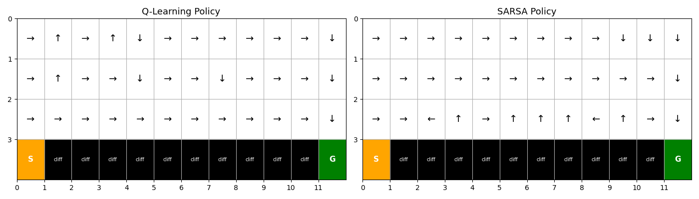
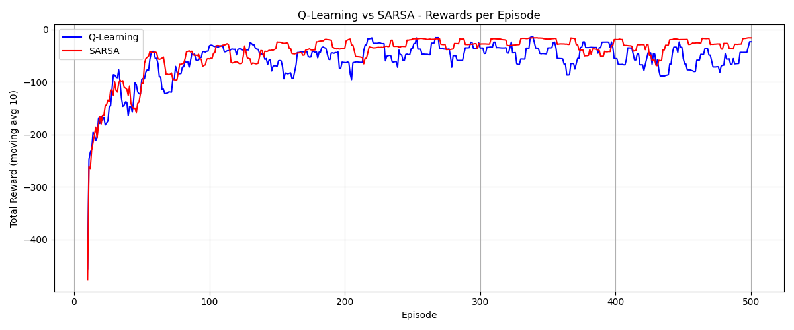
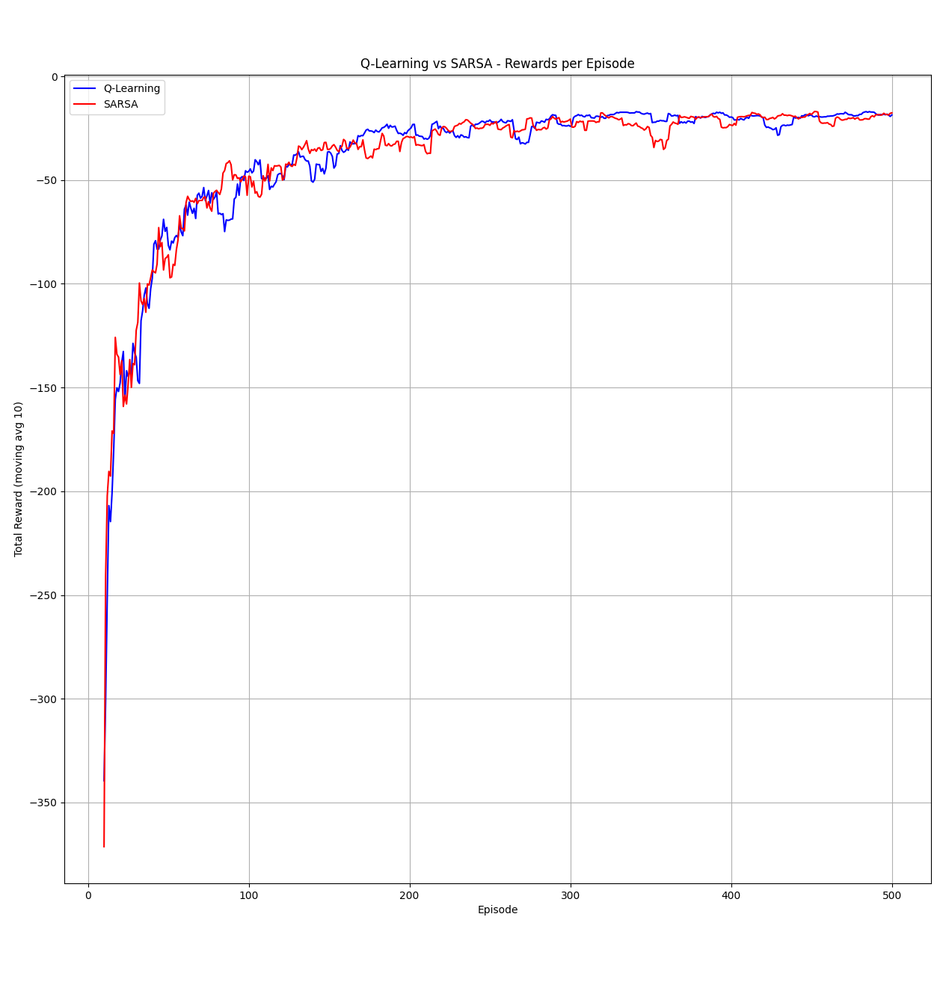

# Main difference vs. Supervised learning

Instead of getting a *(input, correct_output)* tuple pair, it interacts with an environment *(in our case the CliffWalkingEnv)*, where it can make its own decisions and based on what it does it gets *rewarded* or *penalized*, the agent learns based on the cost.

## Meaning
- state: where the agent is (encoded value of the matrix position)
- Q table: a 2D matrix where the rows:*states* and columns:*actions*, so for our example: 4 actions * (4 total pos. grid rows * 12 pos. grid columns = 48 states) = 192 Q values
- Encoding/Decoding: states are represented by a x axis y axis value pair, but to use it properly in another matrix we encode it -> each state maps out to an unique id
- alpha: learning rate
- gamma: discount factor - how much do future rewards matter to immediate rewards
- episode: how many times we put the agent to run the course, each time it starts at the same time, but each episode he learns something new 

## Epsilon greedy policy

How we solve the exploration problem, *if we always pick the paths we know, how do we know we picked the best one* ?

This is where **epsilon** comes in, his role is *the probability of random exploration*, with time the agent learns that cliffs are bad, but the fastest route is along the cliffs, so epsilon prompts 1/10 tries to explore (*which might include along the cliff*)

# Q Learning

Each state-action pair gets a score: **Q-value**, the higher the score is, the better the long-term reward is (*How good is this action from this state*). 
## The update rule

`Q(state, action) += alpha*( target - Q(state, action) )`
and
`target = reward + gamma * max(Q_next state)` 

*Mention: Q_next_state is determined by computing, state.decode + action 9/10 times, and a random action 1/10 -> epsilon*

So the next-state we get from the step() function, and we just pick the highest value from the Q-table for that specific state

The agent assumes it will takes the next best_action 10/10 times, and updates the Q-table score, even if the 1/10 chance of exploring hits *so even if it explores, it assumes the next move will be optimal no matter what it has does currently*

# State Action Reward State Action

Instead of assuming optimal future behavior like Q, Sarsa just behaves as it has until now

## The update rule

`Q(state, action) += alpha * (reward + gamma*Q(next_state, next_action) 
`- Q(state, action ))`

Instead of using the next_best_state like Q, it uses the actual next state it receives
*But where do we get the next_action?* : `a_next = epsilon_greedy(Q[s_next])`, so if the agent explores randomly, Sarsa will learn randomness too  

# The difference

*This graphs shows the most common action taken in every possible state by both agents*
We can see that Sarsa avoids the cliffs as much as possible, and that Q goes straight for it

*This graphs shows the reward progression based on episodes*
We can see that at the beginning Q's reward is much lower (*because the agent goes to the cliffs*), but in the end it ends up higher, because it has learnt the fastest path is along the cliffs, whereas Sarsa avoids the cliffs

# Questions

## Which agent learns a faster way using the greedy policy? Which one one has the biggest reward function during training ?

- Q learns the faster way in the end, because it goes near the cliffs `-12 final reward`, while Sarsa goes the fastest safe way `-16 final reward`
- Sarsa has a higher reward score during training because it avoids the cliffs, while Q has a lower one since it very often falls in htem

## Why do the agents converge in different policies? 

- Q is off-policy, so its goal is built thinking that in its next state, the agent will behave optimally, no matter what the agent actually does, it ignores the fact that the agent explores 1/10 times, the values near the cliff stay high, because it always assume its going to be alright (*it thinks its going to behave optimally and not fall*).
- Sarsa is on-policy, its goal is built on actual action its going to take, so knowing that 1/10 times it explores, it gets scared to go near the cliffs, knowing that 1/10 times it will reset.

## Why isnt there a contradiction between answer A and answer B ?

- There is no contradiction, because in the end, during training the safe Sarsa has higher scores, but it cannot go faster because it dosent like risk. The go ahead Q, jumps off the cliffs many  times and it learns the optimal path. Q acts like its perfect, so it dosent know it might fail near the cliffs, Sarsa knows that, and so it avoids them comlpetely, therefore not going faster.

# Reward shaping

We will modify the reward function so that both agents converge on the same solution.
*Intution*: make the cliff penalty lower, so that Sarsa gets more confident, Q will behave the same
*Truth*: we made the row one above the cliff be a -2 penalty, and then changed the cliff penalty to between -30 and -40 (-37 being the sweet spot), and they both converged to -16 reward

# Epsilon scheduling

We impmeneted a `decay` poperty, that multiplies the epsilon by decay (*0.980 on our case*), so when epsilon converges to 0 (never reaching it), Sarsas target becomes identical to Q, so essentially they become the same algo.  

# Reflection

## What happends if we set epsilon 0 for both agents ?

- Q will never explore, it will only exploit, so it will take the same path as the first one he chooses, it may never discover the optimal one.
- Sarsa might get stuck on a suboptimal path and not be able to escape it thru exploring.

## What happends if gama < 1, how does each agents preference change, short dangerous way vs. safe way ?

- Q will still go the dangerous route, but now with even more incentive, since reaching the goal faster means the discounts get lessened.
- Sarsa - the penalty for falling gets reduced, so it will try the cliffside more ofter
- Both will prefer the shorter route in this case

## Real world example where we would prefer Sarsa ?

- Determining the optimal flight path for a plane, planes cannot afford to skim close to buildings/mountains etc, even if its optimal
