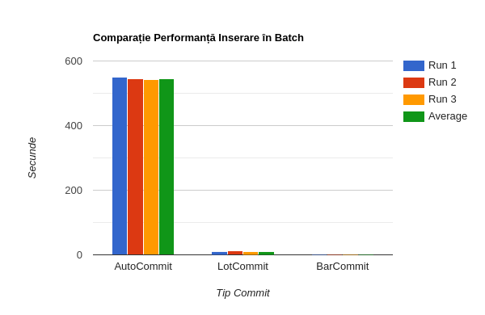

# Set up
Folosim ca baza de date MySQL(InnoDB engine) -> permite probleme de concurenta
REPEATABLE_READ este nivelul de isolare a tranzactiilor default

# 1 Nivele de Tranzactii

## A Dirty Read

Cu nivelul de izolare READ_COMMITED Tranzactia B a citit valoarea 5000
Cu nivelul de izolare READ_UNCOMMITED Tranzactia B a citit valoarea 10000

```java
connA.setAutoCommit(false);
connB.setAutoCommit(false);
System.out.println("Auto Commit set false for connections");
		
		            connB.setTransactionIsolation(Connection.TRANSACTION_READ_UNCOMMITTED);
System.out.println("Read Uncommited set true for connection B");
```

## B Non Repeatable Read

Cu nivelul de izolare READ_COMMITED Tranzactia A citeste 5000 si 12000
Cu nivelul de izolare REPEATABLE_READ Tranzactia A citeste 5000 si 5000

in rsFinal daca aplicam prepareStatement(SELECT)
-connA inca va vedea 5000
-connB va vedea 12000

```java
PreparedStatement psFinal = connB.prepareStatement("SELECT salary FROM employees WHERE id = 1");
ResultSet rsFinal = psFinal.executeQuery();

if (rsFinal.next()) {
    int salary = rsFinal.getInt("salary");
    System.out.println("Final salary in DB: " + salary);
}
```

## C Phantom Read

Cu nivelul de izolare READ_COMMITED, tranzactia A citeste 0 si 1
Cu nivelul de izolare REPEATABLE_READ, tranzactia A cisteste 0 si 0
Final count in DB: 1

## Lost Update

Cu nivelurile de izolare READ_COMMITED sau REPEATABLE_READ, tranzactia A citeste salariul 6200 si updateaza la 6000 (2nd)
Tranzactia B citeste 6000 si updateaza la 5500 (1st)
Final salary in DB :  6000
Update-ul facut de tranzactia B este pierdut

### Cum prevenim ?

**Optimistic Locking**:  adaugam un `updated_at:timeStamp`, si fiecare tranzactie verifica daca obiectul a fost modificat de la ultima citire

**Modificari Atomice**: modificam obiectul direct in baza de date

**Nivel izolare Serializable**:  cand facem un read, imediat row-ul citit primeste un lock ca si cum ar gi updatat fix dupa

tranzactia A cu nivel izolare SERIALIZABLE citeste salariul 6200 si updateaza la 6000
Final salary in DB :  5500 (1st)

# 2 Deadlock

Tranzactia A si Tranzactia B tin (U) lock-urile pentru obiectele cu id = 5 respectiv id =6
si incearca sa obtina lock-urile (U) pentru inversa ei (6 pentru A si 5 pentru B)

### Cum prevenim ?

Adaugam o ordine stricta de obtinere a lock-urilor: obtinere in ordine crescatoare a obiectelor de modificat `lock row 5 → dupa row 6`

#### Tranzactia A
```java
UPDATE employees SET salary = 6000 WHERE id = 5;
sleep(2s);
UPDATE employees SET salary = 7000 WHERE id = 6;
commit;
```
#### Tranzactia B
```java
UPDATE employees SET salary = 6000 WHERE id = 5;
sleep(2s);
UPDATE employees SET salary = 7000 WHERE id = 6;
commit;
```

### Final State in DB
```
Employee 5 salary = 6000
Employee 6 salary = 7000
```

# 3 Comparatie inserare in Batch

## Abordarea 1: Auto Commit

Run 1:  `550632.801504ms ~ 550s ~ 9.17m`
Run 2: `545071.164393ms ~ 545s ~ 9.08m`
Run 3: `543201.276303ms ~ 543s ~ 9.05m 
**Average**: `546.302 ms ≈ 546s ≈ 9.06s`

## Abordarea 2: Lot Commit

Run 1: `11122.560942ms ~ 11.12s`
Run 2: `11570.046094ms ~ 11.57s`
Run 3: `10395.765567ms ~ 10.39s`
**Average**: `11029.457534ms ~ 11.03s`

## Abordare 3: Batch Commit

Run 1: `1291.443531ms ~ 1.29s`
Run 2: `1040.314636ms ~ 1.04s`
Run 3: `1114.485772ms ~ 1.11s`
**Average**: `1148.748ms ~ 1.15s`

### Care este diferenta ?

Auto Commit face 5000 de commit-uri catre bazade date = logging, writing, idx updates + network
Lot commit face 5000/100 500 de commit-uri, este mai rapid umpic dar tot se face logging, idx updates, network travels de 500 de ori
Batch commit face 1 commit central *Cons*: daca ceva da fail la row-ul 4999, rollback


.png)