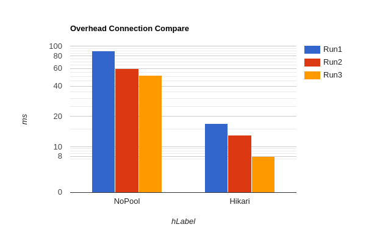

## Code comparing

We replaced our `DataBaseConfig` (singleton that dished out connections), with JPAUtil, that dishes out sessions 

```java

public class JPAUtil {
    private static final EntityManagerFactory emf =
            Persistence.createEntityManagerFactory("default");

    public static EntityManagerFactory getEntityManagerFactory() {
        return emf;
    }
}

```

So before every *Transactional* query looked different, so we had to write 3 different Repos, but using Hibernates API we can generalize it more, I didnt want to change the code that much, but instead of 3 repositories we could have had

```java

public class GenericRepository<K,T> implements IRepository<K,T>{
	private final Class<T> type;  
  
	public GenericRepository(Class<T> type) {  
		this.type = type;  
	}

	public void add(T entity) {  
		Transaction tx;  
		  
		try (Session session = HibernateUtil.getSessionFactory().openSession()){ 
			tx = session.beginTransaction();  
		  
			session.persist(entity);  
		  
			tx.commit();  
			}  
		}  
		  
	public void delete(Long id) {  
			Transaction tx;  
			  
			try (Session session = HibernateUtil.getSessionFactory().openSession()) {  
				tx = session.beginTransaction();  
				  
				T entity = session.get(type, id);  
				if (entity != null) session.remove(entity);  
				  
				tx.commit();  
				}  
	}  
		  
	public void update(T entity) {  
			Transaction tx;  
			  
			try (Session session = HibernateUtil.getSessionFactory().openSession()) {  
				tx = session.beginTransaction();  
				  
				session.merge(entity);  
				  
				tx.commit();  
			}  
	}
		
		// this can be the same as well 
		
	public List<T> getAll(){
		try(Session session = Hibernateutil.getSessionFactory().openSession()){
			return session.createQuery("FROM " + type.getSimpleName(), type).list();
			// at runtime "FROM Park", Park.class
		}
	}	
}

```

Each of our 3 repos could have implemented this example

```java

@Override
    public Park find(Long key) {
        try(EntityManager em = JPAUtil.getEntityManagerFactory().createEntityManager()){
            return em.find(Park.class, key);
        }
    }
```

The Controller code remained the exact same, since we just updated our database access and how we write/connect to it, we didnt make modifications to the methods

## Lazy vs Eager Loading

### Lazy Loading

The *default* for relations in between Entities, loads the entity only when its references

**Why use in Park-Trail relationship**
Trail references Park thru one single FK column, so the access is resolved easily

**Why not in Trail-Tag**
Tag and Trail reference eachother only in their join table `trail-tags`, it requires an extra query + collection build

### Eager Loadng

Data is fetched immediately after parent entity is referenced

**Why it works in Trail-Tag**

JavaFX tries to acess unloaded tags thru the Trail object and fails

## No Pool vs HikariCP Pooling

RUN 1:
	No Pool: 90ms
	Hikari: 17ms
RUN 2 :
	No Pool: 60ms
	Hikari: 13ms
RUN 3:
	No Pool: 51ms
	Hikari: 8ms

```java
EntityManager em = pooledEmf.createEntityManager();
            em.getTransaction().begin(); // grab one connection
            em.getTransaction().rollback(); // clean
            em.close();
```

### What HikariCP does

Instead of doing a 4 way TCP handshake 100 times it does it once, so for NoPool they each open up a new connection, Hikari reuses the old ones



## Reducere Cod

*Inainte de ORM*

```java
@Override
    public void add(Trail entity) {
        try {
            connection.setAutoCommit(false);
            Long key = insertTrail(entity);

            if (key == null) {
                connection.rollback();
                throw new SQLException("Insert failed");
            }

            insertTags(key, entity.getTags());
            connection.commit();

        } catch (SQLException e) {
            try {
                connection.rollback();
            } catch (SQLException ex) {
                System.err.println(ex.getMessage());
            }
            System.err.println(e.getMessage());
        } finally {
            try {
                connection.setAutoCommit(true);
            } catch (SQLException e) {
                System.err.println(e.getMessage());
            }
        }
    }

    private Long insertTrail(Trail trail) throws SQLException {
        String sql = "INSERT INTO trails (name, length, park_id) VALUES (?, ?, ?)";

        try (PreparedStatement ps = connection.prepareStatement(sql, Statement.RETURN_GENERATED_KEYS)) {
            ps.setString(1, trail.getName());
            ps.setDouble(2, trail.getLength());
            ps.setLong(3, trail.getPark().getId());

            ps.executeUpdate();

            try (ResultSet rs = ps.getGeneratedKeys()) {
                if (rs.next()) {
                    return rs.getLong(1);
                }
            }
        }
        return null;
    }
```

*Dupa ORM*

```java
@Override
    public void add(Trail entity) {
        try (EntityManager em = JPAUtil.getEntityManagerFactory().createEntityManager()) {
            EntityTransaction transaction = em.getTransaction();

            transaction.begin();

            em.persist(entity);

            transaction.commit();
        }
    }
// impreuna cu aceasta schimbare

    @ManyToMany(fetch =  FetchType.EAGER)
    @JoinTable(
            name="trail_tags",
            joinColumns = @JoinColumn(name="trail_id"),
            inverseJoinColumns = @JoinColumn(name="tag_id")
    )
    private  List<Tag> tags;
```

